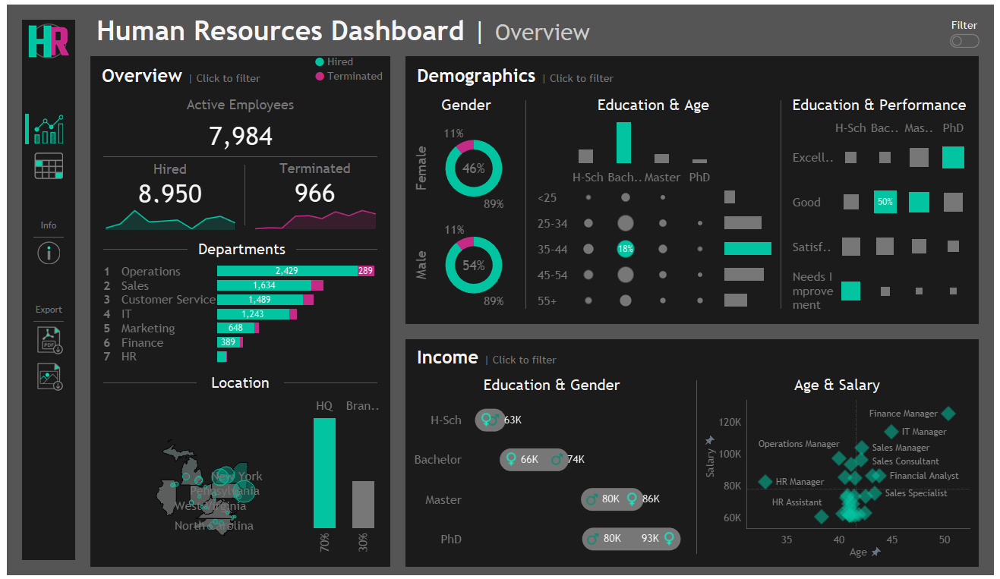
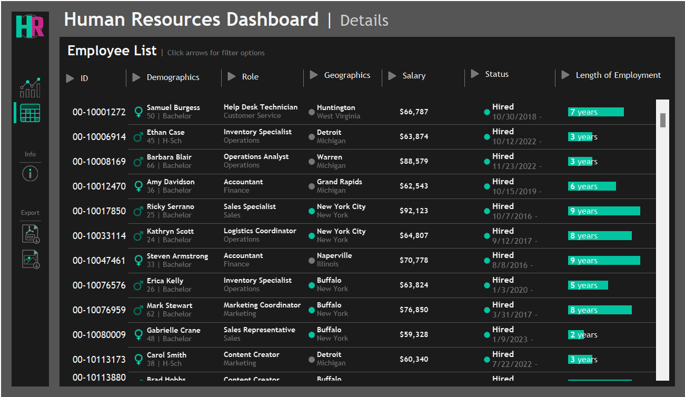

# Tableau HR Dashboard 👥📈

This project is an interactive Tableau dashboard designed to analyze employees data. 
The dashboard highlights trends, performance metrics, and key insights
across multiple years.

🔗 [View the Dashboard on Tableau Public](https://public.tableau.com/views/HRDashboards_17473175745560/HRSummary?:language=en-US&:sid=&:redirect=auth&:display_count=n&:origin=viz_share_link)

### 🛠 Tools Used
Tableau Public – Data visualization and dashboard development
Mysql - Data cleaning and EDA

### 📁 Dataset
- [Data with Baraa Pratice Dataset](https://www.datawithbaraa.com/tableau/tableau-hr-project-thank-you/)
- The dataset was generated using ChatGPT prompts and the Python Faker library. 
- It simulates realistic HR data, including demographics, job details, salary, performance evaluations, and attrition data. 

### 📈 HR Summary Dashboard Features
- KPIs Overview: Trends in hiring, terminations, and active employee counts
- Bar chart: Hired & terminated employees by department
- Map: Geographic distribution of hires (state and city), HQ vs. branches
- Heatmaps: Age vs. education level, education vs. performance rating
- Barbell chart: Salary comparison by gender and education level
- Scatter plot: Average age and salary for role
- Interactive Filters: Gender, employment status, location and hire date

### 👥 HR Details Dashboard Features
- Employee List: View individual details such as:
  - Demographics
  - Role
  - Location
  - Salary
  - Employment Status
  - Length of employment
- Column Filters: Easily filter and sort by any attribute

### 🔧 Dashboard Interactivity
Users can:
- Use filters and charts to drill into specific segments
- Interactive charts double as filters for enhanced user experience
- Navigate seamlessly between Summary and Details dashboards

### 🔍 Insights

- Hiring Trends: Peak in 2017 (1,560 hires), lowest in 2021 (422)
- Terminations: Highest in 2023 (174 employees)
- Headquarters: 70% of employees
- Top Salaries:
  - Finance Manager ($149,377)
  - Sales Manager ($135,055)
  - IT Manager ($133,425)
- Termination-to-Hire Ratio by Education:
  - Highest: Bachelor's degree (12.6%)
  - Lowest: PhD (10.4%)
- By Department:
  - Highest: Finance (16.2%), HR (13.2%), Customer Service (12.4%)
  - Lowest: Marketing (10.8%), IT (11.2%)
- Performance Ratings by Age:
  - Under 25: Lowest "Excellent" (15.0%), highest "Needs Improvement" (14.0%)
  - 55+: Highest "Excellent" (19.9%), lowest "Needs Improvement" (11.8%)
- Performance Ratings by Department:
  - Best: Sales (23.7% "Excellent", 7.0% "Needs Improvement")
  - Worst: Customer Service (13.6% "Excellent", 19.7% "Needs Improvement")
- Gender Pay Gap by Education:
  - At lower levels (High School, Bachelor), males earn more
  - At higher levels (Master's, PhD), females earn more, with a ~$13K gap at PhD level 
- Other Notable Stats:
  - Highest average salary & age: Finance Manager ($125,123; 50 years old)
  - Youngest average role: HR Manager (33 years old)
  - Lowest average salary: HR Assistant ($60,645)

### 💡 What I Learned
This project helped me practice:
- SQL-based data cleaning and exploration 
- Designing interactive dashboards in Tableau 
- Creating user-friendly visual stories 
- Extracting meaningful business insights from raw data

Feel free to explore it and reach out with feedback!

Thank You!

Veronika Shevchenko

